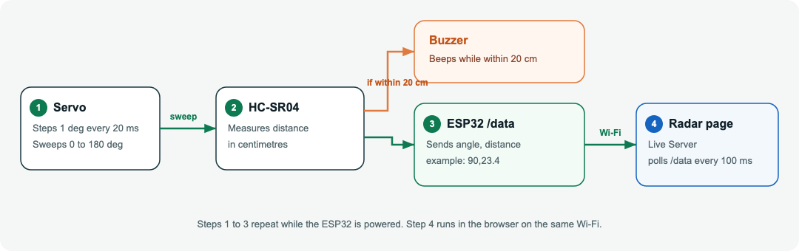
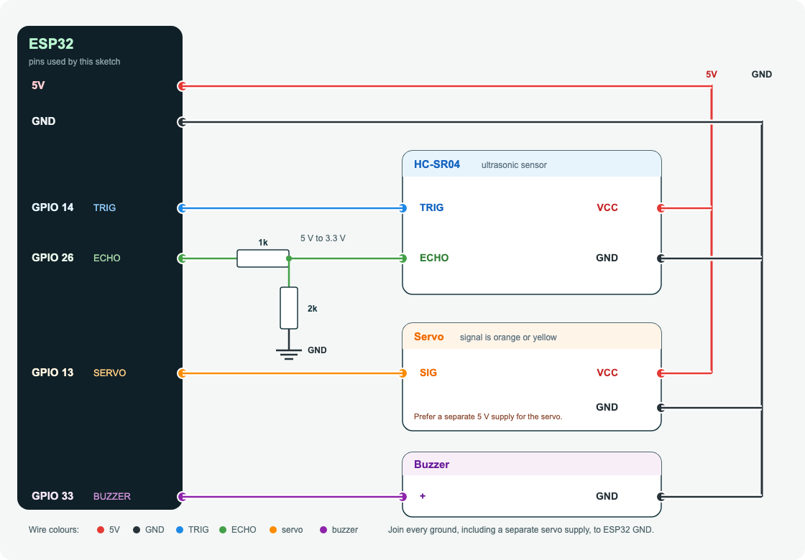

# ESP32 Smart Radar — Getting Started

This project sweeps an ultrasonic sensor with a servo and shows live distance on a radar page in your browser.

Two programs work together:

1. **ESP32 firmware** (`radar_dashboard.ino`) — reads the sensor, moves the servo, beeps the buzzer, and answers one web address: `http://<ESP32-IP>/data`.
2. **Dashboard** (`data/index.html`, `data/style.css`, `data/script.js`) — a web page you open on your computer. It asks the ESP32 for the latest angle and distance about 10 times a second and draws them on the radar.

The ESP32 does not host the radar page. Your computer does, using a local server in VS Code. The computer and the ESP32 must be on the **same Wi-Fi network**.

## How a reading reaches the page



The ESP32 repeats steps 1 to 3 for as long as it has power. The radar page (step 4) updates only while Live Server is running and your computer is on the same Wi-Fi network.

## What you need

**Hardware**

- ESP32 development board (USB cable that carries data, not charge-only)
- HC-SR04 ultrasonic sensor
- Servo motor (SG90 or similar)
- Buzzer
- Jumper wires
- A separate 5 V supply for the servo is safer than powering the servo from the ESP32 5 V pin

**Software**

- [Arduino IDE 2](https://www.arduino.cc/en/software)
- [Visual Studio Code](https://code.visualstudio.com/)
- The **Live Server** extension in VS Code (publisher: Ritwick Dey)

**Network**

- A 2.4 GHz Wi-Fi network. Most ESP32 boards cannot join 5 GHz-only networks.
- The laptop that opens the dashboard must join that same network.

## Wiring



| Part | Connect to |
| --- | --- |
| HC-SR04 VCC | 5 V |
| HC-SR04 GND | GND |
| HC-SR04 TRIG | GPIO 14 |
| HC-SR04 ECHO | GPIO 26 |
| Servo signal (orange or yellow) | GPIO 13 |
| Servo VCC (red) | 5 V (external supply recommended) |
| Servo GND (brown or black) | GND, shared with the ESP32 |
| Buzzer + | GPIO 33 |
| Buzzer − | GND |

The HC-SR04 echo pin is a 5 V signal. ESP32 pins are 3.3 V. A voltage divider on ECHO (for example 1 kΩ from ECHO to GPIO 26, and 2 kΩ from GPIO 26 to GND) protects the board. Share one common ground between the ESP32, sensor, servo supply, and buzzer.

## Part 1 — Upload the firmware with Arduino IDE

### 1. Install the ESP32 board package

1. Open Arduino IDE.
2. Go to **Arduino IDE → Settings** (macOS) or **File → Preferences** (Windows).
3. In **Additional boards manager URLs**, paste:

   ```
   https://espressif.github.io/arduino-esp32/package_esp32_index.json
   ```

   If a URL is already there, add this one on a new line.
4. Click **OK**.
5. Open **Tools → Board → Boards Manager**.
6. Search for `esp32`.
7. Install **esp32 by Espressif Systems**.

### 2. Install the servo library

The sketch uses `ESP32Servo`. The regular Arduino `Servo` library does not work on ESP32.

1. Open **Sketch → Include Library → Manage Libraries**.
2. Search for `ESP32Servo`.
3. Install **ESP32Servo** by Kevin Harrington.

`WiFi.h` and `WebServer.h` come with the ESP32 board package. Do not install extra libraries for those.

### 3. Open the sketch

1. In Arduino IDE, choose **File → Open**.
2. Open `radar_dashboard.ino` in this project folder.
3. Arduino IDE may ask to create a sketch folder. Choose a place you can find again, or open the `.ino` file directly if it already sits in its own folder.

### 4. Set your Wi-Fi name and password

Near the top of `radar_dashboard.ino`, replace the two strings with your own network:

```cpp
const char* ssid = "YOUR_WIFI_NAME";
const char* password = "YOUR_WIFI_PASSWORD";
```

Use the exact name, including spaces and capital letters. Save the file.

### 5. Select the board and port

1. Plug the ESP32 into the computer with a data USB cable.
2. **Tools → Board → esp32 → ESP32 Dev Module**.
   If your board is a specific model (ESP32-S3, WROOM, and so on), pick that model instead.
3. **Tools → Port** and choose the port that appeared when you plugged the board in.
   - macOS: something like `/dev/cu.usbserial-0001` or `/dev/cu.SLAB_USBtoUART`
   - Windows: `COM3`, `COM4`, or another COM port
4. Leave **Upload Speed** at `115200` if upload fails at a higher speed.

If no port appears, install the USB driver for your board’s chip (CP210x or CH340) and try another cable.

### 6. Upload

1. Click the **Upload** arrow.
2. If upload stalls at “Connecting…”, hold the **BOOT** button on the ESP32 when the IDE says “Connecting”, then release it after upload starts. Some boards need this every time.

### 7. Copy the ESP32 IP address

1. Open **Tools → Serial Monitor**.
2. Set the baud rate to **115200** (bottom-right of the Serial Monitor).
3. Press the **EN** or **RST** button on the ESP32.
4. Wait until you see lines like:

   ```
   Wi-Fi connected
   ESP32 IP Address: 192.168.1.42
   Web server started
   ```

5. Write down that IP address. You will paste it into the dashboard in the next part.

If the monitor only prints `Connecting to Wi-Fi.....` and never continues, the Wi-Fi name or password is wrong, or the network is 5 GHz only.

## Part 2 — Run the dashboard from VS Code

The page in `data/` is a normal website. Opening `index.html` by double-clicking it uses a `file://` address, and the browser will block the request to the ESP32. Use Live Server so the page is served as `http://127.0.0.1:...`.

### 1. Install Live Server

1. Open VS Code.
2. Open **Extensions** (the square icon on the left, or `Shift+Cmd+X` on macOS, `Shift+Ctrl+X` on Windows).
3. Search for `Live Server`.
4. Install **Live Server** by Ritwick Dey.

### 2. Point the page at your ESP32

1. In VS Code, choose **File → Open Folder** and open this `radar_dashboard` folder.
2. Open `data/script.js`.
3. Change the first setting to the IP address from the Serial Monitor:

   ```js
   const ESP32_IP = "192.168.1.42";
   ```

   Use your address. Do not add `http://` and do not add `/data`. The script adds those.
4. Save the file.

### 3. Start the local server

1. In the Explorer, right-click `data/index.html`.
2. Choose **Open with Live Server**.

   You can also click **Go Live** in the blue status bar at the bottom of VS Code after the file is open.

3. A browser tab opens, usually at:

   ```
   http://127.0.0.1:5500/data/index.html
   ```

   or:

   ```
   http://127.0.0.1:5500/index.html
   ```

   The exact path depends on which folder you opened. Either address is fine as long as you see the radar page.

4. To stop the server, click **Port: 5500** (or **Go Live**) in the VS Code status bar again.

Keep the ESP32 powered and connected to Wi-Fi while the page is open. The page does not need the USB serial connection after you have the IP address, but the ESP32 still needs power and Wi-Fi.

## What you should see

- The green sweep line follows the servo, from 0° to 180° and back.
- **ANGLE** shows the servo angle.
- **DISTANCE** shows the ultrasonic reading in centimeters. `-- cm` means the sensor got no echo.
- **STATUS** shows `OBJECT DETECTED` when something is within about 40 cm, and `CLEAR` when the path is empty.
- An orange dot is drawn on the radar when something is within 20 cm.
- The buzzer on the ESP32 beeps when an object stays within 20 cm.

The radar scale is marked at 10, 20, 30, and 40 cm.

## Quick check that the ESP32 is answering

On the same computer, open this address in a browser (use your IP):

```
http://192.168.1.42/data
```

A working board returns one line of plain text, for example:

```
90,23.4
```

That is `angle,distance`. If this page does not load, the dashboard cannot load either. Fix Wi-Fi and the IP address before changing the web page.

## Troubleshooting

**Serial Monitor stays on “Connecting to Wi-Fi”**

- Recheck the Wi-Fi name and password in the sketch, then upload again.
- Use a 2.4 GHz network.
- Move the ESP32 closer to the router.

**`/data` does not open in the browser**

- The computer and ESP32 must be on the same Wi-Fi. Guest networks and phone hotspots often block device-to-device traffic.
- The IP can change after a router restart. Read it again from the Serial Monitor and update `ESP32_IP` in `data/script.js`.
- Confirm the sketch printed `Web server started`.

**The radar page opens, but angle and distance never change**

- Open the browser developer tools (**View → Developer → JavaScript Console**) and look for `ESP32 connection error`.
- Confirm `ESP32_IP` has no `http://`, no spaces, and no trailing slash.
- Reload the Live Server page after saving `script.js`. Live Server usually reloads on save.

**Distance stays at `-- cm`**

- Check TRIG on GPIO 14 and ECHO on GPIO 26.
- Point the sensor at a flat surface within 40 cm.
- Confirm the sensor has 5 V and a shared ground.

**Servo does not move, or the ESP32 resets when the servo moves**

- Power the servo from a separate 5 V supply.
- Connect that supply’s ground to the ESP32 ground.
- Confirm the signal wire is on GPIO 13.

**Upload fails in Arduino IDE**

- Close Serial Monitor and any other app using the port.
- Select the correct port under **Tools → Port**.
- Hold **BOOT** during “Connecting…”.
- Try upload speed `115200`.

## Project files

| File | Role |
| --- | --- |
| `radar_dashboard.ino` | ESP32 program: Wi-Fi, sensor, servo, buzzer, `/data` server |
| `data/index.html` | Radar page layout |
| `data/style.css` | Page appearance |
| `data/script.js` | Draws the radar and reads `http://<ESP32-IP>/data` |
| `docs/wiring.png` | Connection diagram |
| `docs/flow.png` | Flow from the sensor to the radar page |
